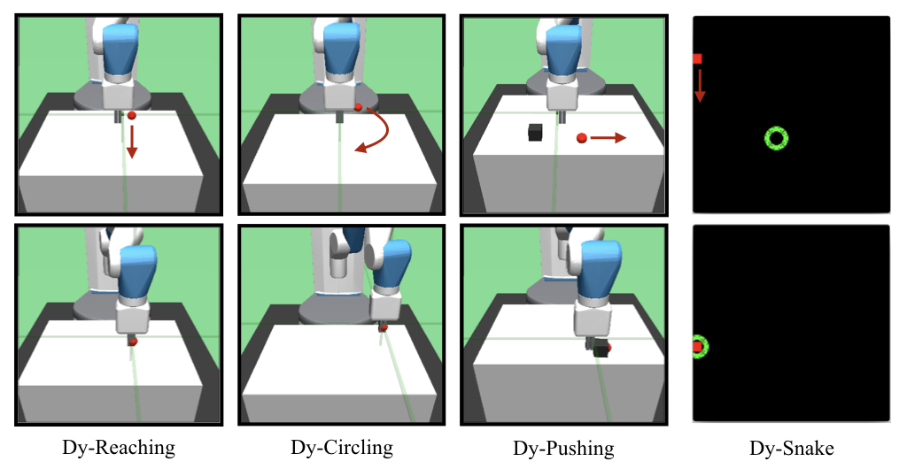
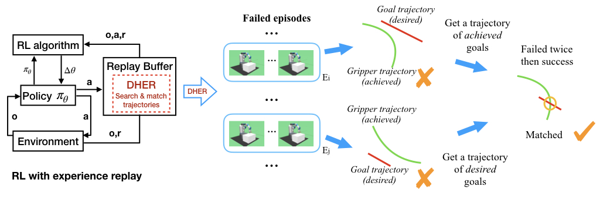

# Dy Envs
There are dynamic goal environments. We modify the robotic manipulation environments created
by OpenAI (Brockman et al., 2016) for our experiments. 



As shown in above figure, we assign certain rules to the goals so that they accordingly move in the environments while an agent is required to control the robotic arm's grippers to reach the goal that moves along a straight line (Dy-Reaching), to reach the goal that moves in a circle (Dy-Circling), or to push a block to the goal that moves along a straight line (Dy-Pushing). 

> NOTE: The first three tasks need mujoco. The fourth task does not need mujoco but pygame. It is cheaper to only install Dy-Snake.

## How to install it

Our environments depend on [openai gym](https://github.com/openai/gym). Please install gym (ver-0.10.9) at first.

``` shell
cd dygym
python install -e .
```

## Test new environments

``` shell
cd dygym/test
python test_dyreach.py
```

# DHER
Our algorithms depend on [openai baselines](https://github.com/openai/baselines). Please install baselines (ver-0.1.5) at first.

## How to install it

``` shell
cd dher
python install -e .
```

## Use DDPG + DHER

``` shell
cd dher/ddpg_dher/experiment
python train_dyreach.py
```

## Use DQN + DHER

``` shell
cd dher/dqn_dher/experiment
python train_dysnake.py
```

> NOTE: In Dy-Snake, the first four digits of an observation indicate achieved goals and desired goals. Our implementation of DQN+DHER uses this trick.

# Key idea - failed twice then success



# Citation
Please cite our ICLR paper if you use this repository in your publications:

```
@inproceedings{
fang2018dher,
title={{DHER}: Hindsight Experience Replay for Dynamic Goals},
author={Meng Fang and Cheng Zhou and Bei Shi and Boqing Gong and Jia Xu and Tong Zhang},
booktitle={International Conference on Learning Representations},
year={2019},
url={https://openreview.net/forum?id=Byf5-30qFX},
}
```

# Licence
The MIT License
